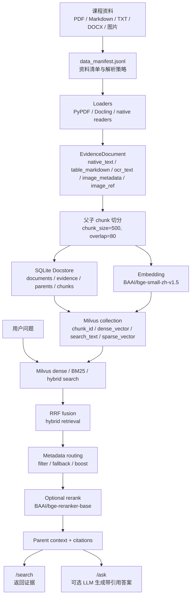

# Course RAG：面向课程资料的智能问答系统

`course_rag/` 是一个面向课程资料和复习资料的 RAG 问答项目。它把分散在 PDF、Markdown、TXT、DOCX、图片和表格中的学习资料统一整理成可检索证据，支持混合检索、metadata routing、rerank、引用来源和 FastAPI/Vue 调试界面。

这个项目的目标不是做一个泛化搜索引擎，而是解决学习场景里的三个具体问题：

- 资料分散：课件、往年试题、答案、课堂笔记、图片截图等格式不统一。
- 检索低效：只靠文件名或全文搜索，很难定位到具体页、表格或截图内容。
- 回答不可追溯：LLM 直接回答容易缺少来源，需要把答案和原始资料 citation 绑定。

当前系统已完成从资料入库、索引构建、检索融合、rerank、上下文组装到可选 LLM 生成的主链路，并配套了小型评测集和检索/生成指标。

## 功能特性

| 能力 | 当前实现 |
| --- | --- |
| 多格式资料导入 | 支持 PDF、Markdown、TXT、DOCX，以及图片文件和 Markdown 图片引用的元数据处理。 |
| 统一证据层 | 使用 `EvidenceDocument` 统一文本、OCR、表格、图片元数据和图片引用，保留 `source_name`、`page`、`course`、`category`、`evidence_kind` 等 metadata。 |
| Chunk 与父子上下文 | child chunk 用于检索，parent context 用于回答上下文，减少片段过碎导致的信息缺失。 |
| SQLite Docstore | 默认 `course_rag/data/rag_store.sqlite`，保存 documents、evidence、parent、chunk、metadata 和 ingest run。 |
| 在线检索后端 | 固定使用本地 Milvus standalone，collection 为 `course_rag_v2_text`。 |
| 混合检索 | 支持 Milvus dense vector、Milvus BM25 sparse/full-text 和 `hybrid` 三种策略；默认 hybrid 使用 RRF 融合。 |
| Metadata routing | 支持按课程、资料类别、文件名、页码、模态和 evidence 类型过滤或加权，并在过滤无结果时回退。 |
| Rerank | 可选 `BAAI/bge-reranker-base` 精排；本地模型缺失时保留原排序并返回诊断信息。 |
| 引用来源 | `/ask` 和 `/search` 都返回 citation，答案使用 `[1]`、`[2]` 形式关联资料来源。 |
| API 与前端 | FastAPI 提供 `/health`、`/ingest`、`/search`、`/ask`；Vue 3 + Vite 前端用于本地调试。 |
| 评测体系 | `course_rag/eval/` 包含 golden set、评测脚本和历史结果，覆盖文本、表格、OCR、图片定位、routing 和资料不足问题。 |

## 系统架构



## 当前数据与索引状态

| 项 | 当前值 |
| --- | ---: |
| 默认 docstore | `course_rag/data/rag_store.sqlite` |
| 默认在线后端 | Milvus standalone |
| 默认 collection | `course_rag_v2_text` |
| vectors / chunks | 9138 |
| parent 数 | 5840 |
| embedding 维度 | 512 |
| evidence 总数 | 5724 |
| `native_text` | 4243 |
| `ocr_text` | 998 |
| `table_markdown` | 139 |
| `image_metadata` | 177 |
| `image_ref` | 167 |
| `caption` | 0 |

VLM caption provider 已接入但默认关闭，当前主线不把 caption 纳入默认索引，避免慢任务和不稳定视觉描述污染检索结果。

## 技术栈

- 后端：FastAPI、Pydantic、SentenceTransformers、SQLite 标准库、Milvus。
- 文档解析：PyPDF、Docling、native Markdown/TXT reader、RapidOCR 离线 OCR。
- 生成模型：兼容 OpenAI 接口的 DeepSeek 服务，默认模型 `deepseek-v4-pro`，可通过 `use_llm=false` 关闭外部调用。
- 前端：Vue 3、Vite、TypeScript。
- 评测：自定义 golden set + 检索指标 + citation 检查 + 可选 LLM-as-judge。

## 快速开始

项目默认使用仓库根目录下的虚拟环境：

```powershell
.\rag\Scripts\python.exe
```

不要默认使用系统 Python、`.venv` 或 `course_rag/.venv`。

1. 打开 Docker Desktop，确认 Docker daemon 正常运行。

2. 启动本地 Milvus：

```powershell
powershell -ExecutionPolicy Bypass -File course_rag\scripts\milvus_up.ps1
```

3. 首次启动或资料更新后，重建 SQLite docstore 和 Milvus collection：

```powershell
powershell -ExecutionPolicy Bypass -File course_rag\scripts\milvus_rebuild_index.ps1
```

4. 检查 Milvus collection 和小样本查询：

```powershell
powershell -ExecutionPolicy Bypass -File course_rag\scripts\milvus_check.ps1
```

5. 启动 FastAPI：

```powershell
.\rag\Scripts\python.exe -X utf8 -m uvicorn course_rag.app.main:app --reload
```

服务地址：

```text
http://127.0.0.1:8000
```

Swagger：

```text
http://127.0.0.1:8000/docs
```

前端开发模式：

```powershell
cd course_rag\frontend
npm.cmd run dev
```

前端开发地址：

```text
http://127.0.0.1:5173
```

如果已经构建过前端，FastAPI 也会托管 `course_rag/app/static/frontend/` 下的静态页面。

截图建议保存到 `course_rag/docs/assets/`，例如 Swagger 页面或前端问答界面。当前 README 不插入不存在的图片链接，避免 GitHub 展示破图。

## API 使用

### `GET /health`

返回服务、SQLite docstore 和 Milvus collection 状态。常用字段：

- `status`
- `index_exists`
- `index_loaded`
- `docstore_exists`
- `docstore_readable`
- `docstore_chunks`
- `milvus_configured`
- `milvus_connected`
- `milvus_collection`
- `milvus_entity_count`
- `milvus_aligned_with_docstore`
- `milvus_error`

### `POST /search`

只做检索并返回 evidence 和 citation，不调用外部 LLM，适合调试检索链路。

默认使用 Milvus + hybrid retrieval：

```json
{
  "query": "FIRST FOLLOW 表格",
  "top_k": 3,
  "use_rerank": false
}
```

指定检索表格 evidence：

```json
{
  "query": "2018-2019 21系编译期末答案中 FIRST/FOLLOW 表格相关内容在哪里？",
  "course": "编译原理",
  "category": "复习",
  "evidence_kind": "table_markdown",
  "top_k": 5
}
```

### `POST /ask`

在检索结果基础上组装上下文，并按需调用外部 LLM 生成答案。

离线验证推荐关闭 LLM：

```json
{
  "question": "计网串讲课件里 OSI 参考模型自底向上有哪些层？",
  "course": "计网",
  "source_name": "串讲+习题课 25.pdf",
  "top_k": 5,
  "use_llm": false
}
```

需要真实生成时保持 `use_llm=true`，并配置环境变量：

```powershell
$env:DEEPSEEK_API_KEY_RAGLEARN="your_api_key"
```

### `POST /ingest`

加载现有索引，或在 `rebuild=true` 时重建 SQLite docstore 并重建 Milvus collection。

```json
{
  "rebuild": true,
  "priority": "mvp,v2",
  "include_visual_evidence": true,
  "include_table_evidence": true,
  "run_ocr": false
}
```

常用请求参数：

| 参数 | 说明 |
| --- | --- |
| `strategy` | `hybrid`、`dense` 或 `bm25`。默认 `hybrid`。 |
| `top_k` | 最终返回证据数量。 |
| `candidate_k` | 召回候选数量，默认按 `max(top_k * 4, 30)` 计算。 |
| `use_rerank` | 是否启用 rerank。 |
| `use_llm` | `/ask` 是否调用外部 LLM。 |
| `course/category/source_name/page` | 显式 metadata 过滤条件。 |
| `modality/evidence_kind` | 指定文本、表格、OCR、图片元数据等证据类型。 |

## 检索策略

当前默认策略是 `hybrid`，核心目标是兼顾语义召回和关键词精确匹配：

1. Milvus dense vector 检索负责语义相近问题，例如“滑动窗口流量控制”这类概念问答。
2. Milvus BM25 sparse/full-text 检索负责保留关键词、文件名、题号、表格术语等精确匹配能力。
3. `hybrid` 同时请求 dense 与 BM25，并用 Milvus `RRFRanker` 融合排序。
4. Metadata routing 根据显式参数或问题意图生成课程、文件、页码、模态、evidence 类型过滤；能下推的过滤先交给 Milvus，过滤无结果时再回退到更宽候选。
5. Rerank 对融合后的候选重排，提升首个正确证据的排序质量。
6. Parent context 从 SQLite docstore 读取父级文档片段补足上下文，citation 仍保留具体 evidence 来源。

这种设计的取舍是：相比纯向量检索，链路更复杂，但可解释性和调试信息更好，也更适合课程资料中常见的“指定文件、指定页、指定表格、指定截图”问题。

## 评测结果

评测集位于 `course_rag/eval/golden_set.jsonl`，共 21 条人工样本，覆盖：

- 文本检索
- 表格 evidence
- OCR evidence
- 图片定位
- metadata routing
- 资料不足拒答

### 当前 fast 检索诊断

来源：`course_rag/eval/results/eval_v2_20260605T180117.md`

配置：`profile=fast`，固定使用 SQLite docstore + Milvus，不调用外部 LLM，不启用 rerank，用于快速检查 dense/BM25/hybrid 检索、metadata routing 和 citation 是否能跑通。

| 指标 | 结果 |
| --- | ---: |
| 样本数 | 21 |
| `evidence_hit@k` | 0.8421 |
| `evidence_recall@k` | 0.7632 |
| `mrr` | 0.6886 |
| `context_precision@k` | 0.4421 |
| `routing_filter_success` | 1.0000 |
| `expected_modality_hit` | 1.0000 |
| `citation_validity` | 0.9524 |
| `citation_coverage` | 0.8421 |
| `answer_fact_coverage` | 0.7851 |
| `abstention_success` | 0.5000 |
| `error_rate` | 0 |
| `llm_error_rate` | 0 |
| 平均耗时 | 962.7 ms |
| P95 耗时 | 241.0 ms |

主要结论：当前主链路运行稳定，Milvus 与 SQLite docstore 数量对齐，fast eval 无运行错误。当前短板主要是 OCR 证据、多证据覆盖、资料不足样本的离线拒答和整体 `context_precision@k`，需要继续通过检索策略和上下文压缩优化。

### 端到端 LLM 评测

端到端 `profile=default` 会启用 rerank、外部 LLM 生成和 LLM-as-judge。当前存储与检索链路已重构，默认 LLM 评测需要在新链路上重新运行后再更新指标。

默认评测命令：

```powershell
.\rag\Scripts\python.exe -X utf8 course_rag\eval\run_eval.py --profile default
```

## 示例问答

以下样例来自 `course_rag/eval/results/eval_v2_20260604T152114.json` 的真实评测输出。

| 场景 | 问题 | 回答摘要 | 来源 |
| --- | --- | --- | --- |
| 文本检索 | 计网串讲课件里 OSI 参考模型自底向上有哪些层？ | OSI 自底向上为物理层、数据链路层、网络层、传输层、会话层、表示层、应用层。 | `串讲+习题课 25.pdf` 第 5 页 |
| 表格证据 | 2018-2019 21系编译期末答案中 FIRST/FOLLOW 表格相关内容在哪里？ | 位于 `2018-2019 21系编译期末答案-yhq.pdf` 第 6 页，表格列出非终结符及其 FIRST/FOLLOW 集。 | `table_markdown` evidence，第 6 页 |
| OCR 证据 | 课堂截图里 FOLLOW 集合的定义和规则是什么？ | 系统从截图 OCR 中提取 FOLLOW 定义、`#` 加入规则、FIRST(β)-{ε} 和 FOLLOW 传播规则。 | `6-8-语法分析.md` 关联截图 OCR |
| 图片定位 | 编译原理作业图片 `2-4.jpg` 的资料路径是什么？ | 返回路径 `course_rag/data/编译原理/作业/2-4.jpg`。 | `image_metadata` evidence |
| Metadata routing | 只在计网资料里找：TCP 三报文握手第二个报文首部中哪些标志位为 1？ | 第二个报文首部中 SYN 和 ACK 标志位为 1。 | `2021-2022计网期末试题A卷.pdf`、`B卷.pdf` 第 3 页 |
| 资料不足 | 这套课程资料里有没有关于量子计算硬件退相干校准流程的详细实验步骤？ | 明确回答资料不足，说明检索到的资料属于计网和编译原理，不支持该问题。 | negative sample |

## 项目结构

```text
course_rag/
├─ app/                         # FastAPI 后端入口与 RAG 服务代码
│  ├─ main.py                   # API 入口，提供 /health、/ingest、/ask、/search
│  ├─ schemas.py                # API 请求和响应模型
│  └─ rag/                      # 文档加载、evidence、chunk、索引、检索、routing、rerank、生成
├─ deploy/milvus/               # Milvus standalone Docker Compose 配置
├─ docs/                        # 项目说明文档和截图占位目录
├─ eval/                        # golden set、评测脚本和评测结果
├─ frontend/                    # Vue 3 + Vite + TypeScript 前端工程
├─ scripts/                     # 数据处理和 Milvus 启停/检查脚本
├─ data/                        # 本地课程资料、SQLite docstore 和处理中间数据，默认不提交
└─ requirements.txt             # Python 后端依赖
```

## 数据与隐私说明

- `course_rag/data/` 存放本地课程资料、SQLite docstore、处理中间结果、OCR 缓存和模型缓存，不适合直接提交公开仓库。
- `course_rag/deploy/milvus/volumes/` 是本地 Milvus、etcd、MinIO 数据目录，不应提交。
- README 中的问答样例只展示摘要和来源，不展开大段原始课程资料。

## 验证命令

语法检查：

```powershell
.\rag\Scripts\python.exe -m compileall course_rag\app course_rag\eval
```

快速离线评测：

```powershell
.\rag\Scripts\python.exe -X utf8 course_rag\eval\run_eval.py --profile fast --no-write-doc
```

端到端 LLM 评测：

```powershell
.\rag\Scripts\python.exe -X utf8 course_rag\eval\run_eval.py --profile default
```

端到端评测需要可用的 `DEEPSEEK_API_KEY_RAGLEARN`，否则评测脚本会降级为离线检索和引用诊断。

## 后续优化

- OCR evidence 排序：当前 OCR 类样本可以命中相关内容，但多证据覆盖和首个正确证据排名仍不稳定。
- 上下文精度：`context_precision@k` 约 0.49，后续可优化候选过滤、rerank 输入和 evidence 类型权重。
- 复杂概念生成：对滑动窗口等多事实问题增强 prompt 或上下文组织，减少关键事实遗漏。
- 响应延迟：端到端平均耗时约 8.1 秒，主要受外部 LLM 与 rerank 影响，可增加缓存或异步处理。
- 展示材料：补充 Swagger 或前端截图到 `course_rag/docs/assets/`，用于简历项目链接展示。
