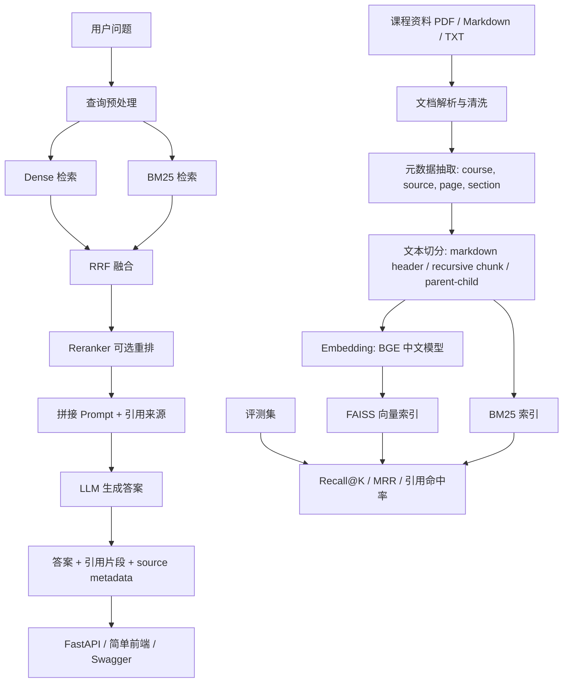

# RAG 两周学习计划索引

## 计划定位

本计划面向 2026 年暑期日常实习准备，目标不是完整学完所有 RAG 理论，而是在两周内基于 `all-in-rag` 复现核心链路，并二次开发出一个可以写进简历、可以运行展示、可以评测对比的 RAG 项目。

最终项目建议定位为：

```text
北航课程资料 RAG 智能问答系统
```

项目主线：

```text
复现 all-in-rag 的文本 RAG 项目
-> 替换为自己的课程/学习资料数据
-> 增加 PDF/Markdown/TXT 导入、引用溯源、混合检索、rerank、评测和 FastAPI 封装
-> 整理成独立 GitHub 项目与简历描述
```

建议新增一个独立目录承载最终项目：

```text
course_rag/
```

不要直接把 `code/C8` 当作最终简历项目。`code/C8` 更适合作为学习和复现底座，最终项目需要有自己的数据场景、接口设计、实验结果和 README。

## 每日计划

| 天数 | 主题 | 文件 |
| --- | --- | --- |
| Day 01 | 项目总览与最小链路 | [Day01_项目总览与最小链路.md](Day01_项目总览与最小链路.md) |
| Day 02 | 复现 `code/C8` 完整项目 | [Day02_复现C8完整项目.md](Day02_复现C8完整项目.md) |
| Day 03 | 确定课程资料场景与数据规范 | [Day03_课程资料场景与数据规范.md](Day03_课程资料场景与数据规范.md) |
| Day 04 | 实现多格式文档加载 | [Day04_多格式文档加载.md](Day04_多格式文档加载.md) |
| Day 05 | 实现 chunk 切分与父子文档策略 | [Day05_Chunk切分与父子文档策略.md](Day05_Chunk切分与父子文档策略.md) |
| Day 06 | 实现 embedding 与向量索引 | [Day06_Embedding与向量索引.md](Day06_Embedding与向量索引.md) |
| Day 07 | 完成第一版可问答 MVP | [Day07_第一版可问答MVP.md](Day07_第一版可问答MVP.md) |
| Day 08 | FastAPI 封装 | [Day08_FastAPI封装.md](Day08_FastAPI封装.md) |
| Day 09 | 实现混合检索与 RRF 对比 | [Day09_混合检索与RRF对比.md](Day09_混合检索与RRF对比.md) |
| Day 10 | 接入 rerank 并配置化 | [Day10_Rerank接入与配置化.md](Day10_Rerank接入与配置化.md) |
| Day 11 | 构建评测集与指标 | [Day11_评测集与指标.md](Day11_评测集与指标.md) |
| Day 12 | Docker 与工程化整理 | [Day12_Docker与工程化整理.md](Day12_Docker与工程化整理.md) |
| Day 13 | README、架构图、演示样例与项目包装 | [Day13_README与项目包装.md](Day13_README与项目包装.md) |
| Day 14 | 简历表达与面试复盘 | [Day14_简历表达与面试复盘.md](Day14_简历表达与面试复盘.md) |

## 最终交付物

两周结束时，应至少产出：

1. 一个可运行的 RAG 项目目录：`course_rag/`
2. 一份项目 README：说明背景、架构、启动方式、接口、效果样例、评测结果
3. 一个 FastAPI 后端：至少支持文档入库、问答、检索结果查看
4. 一个可复现实验脚本：对比不同检索策略或 chunk 参数
5. 一个小型评测集：建议 30 到 50 个问题
6. 一份简历项目描述：3 到 4 条 bullet，突出工程实现和实验对比
7. 一张架构图：可先用 Mermaid，后续再转成图片

## 功能优先级

必须完成：

- 支持 Markdown / TXT / PDF 文档导入
- 支持文档清洗、元数据抽取、chunk 切分
- 支持 embedding 向量化与 FAISS 本地向量索引持久化
- 支持 BM25 + Dense Vector 混合检索，并使用 RRF 融合
- 支持回答时返回引用来源，包括文件名、chunk id、片段内容
- 支持 FastAPI 接口调用
- 支持构建小型评测集，并计算 Recall@K、MRR、引用命中率
- 有清晰 README、架构图、启动命令和样例问题

尽量完成：

- 接入 reranker，对 Top-K 候选结果重排
- 支持 Docker 或 Docker Compose 启动
- 提供一个简单前端页面或 Swagger 演示流程
- 支持配置化切换 chunk size、top_k、检索策略

暂时后置：

- Graph RAG
- 多模态 RAG
- Text2SQL
- Neo4j
- 大规模 Milvus / 分布式部署
- 模型训练或微调

## all-in-rag 仓库使用路线

| 目标 | 参考位置 | 用法 |
| --- | --- | --- |
| 最小 RAG 链路 | `docs/chapter1/03_get_start_rag.md`、`code/C1/` | 第 1 天快速建立全链路概念 |
| 文档加载与切分 | `docs/chapter2/04_data_load.md`、`docs/chapter2/05_text_chunking.md`、`code/C2/` | 用于改造课程资料解析和 chunk |
| embedding 与向量库 | `docs/chapter3/06_vector_embedding.md`、`docs/chapter3/08_vector_db.md`、`code/C3/` | 用于理解 BGE、FAISS、向量检索 |
| 混合检索 | `docs/chapter4/11_hybrid_search.md`、`code/C4/01_hybrid_search.py` | 用于实现 BM25 + Dense + RRF |
| rerank | `code/C4/07_rerank_and_refine.py` | 用于理解重排位置和工程接入方式 |
| 评估 | `docs/chapter6/18_system_evaluation.md`、`code/C6/01_llamaindex_evaluation_example.py` | 用于设计小型评测集和指标 |
| 完整项目底座 | `docs/chapter8/`、`code/C8/` | 两周主线复现对象 |
| Graph RAG | `docs/chapter9/`、`code/C9/` | 暂时跳过，后续加分项 |

最重要的代码底座是 `code/C8`：

- `main.py`：串联初始化、知识库构建、检索、生成
- `config.py`：集中配置数据路径、embedding 模型、LLM、top_k
- `rag_modules/data_preparation.py`：Markdown 加载、元数据增强、父子 chunk
- `rag_modules/index_construction.py`：BGE embedding、FAISS 索引构建与持久化
- `rag_modules/retrieval_optimization.py`：BM25 + 向量检索 + RRF
- `rag_modules/generation_integration.py`：查询路由、查询重写、Prompt、LLM 生成

## 最终项目建议架构



## 建议目录结构

```text
course_rag/
├── app/
│   ├── main.py
│   ├── config.py
│   ├── schemas.py
│   └── rag/
│       ├── loaders.py
│       ├── chunking.py
│       ├── indexing.py
│       ├── retrieval.py
│       ├── generation.py
│       └── citations.py
├── data/
│   ├── raw/
│   ├── samples/
│   └── processed/
├── eval/
│   ├── eval_dataset.jsonl
│   ├── run_eval.py
│   └── results/
├── vector_index/
├── tests/
├── README.md
├── requirements.txt
├── Dockerfile
└── docker-compose.yml
```

## 推荐技术选型

| 模块 | 推荐选择 | 理由 |
| --- | --- | --- |
| 后端 | FastAPI | 实习岗位认可度高，接口清晰，容易展示工程化能力 |
| RAG 编排 | 参考 LangChain 写法，但核心模块自己封装 | 能借助生态，又能体现自己理解了链路 |
| Embedding | `BAAI/bge-small-zh-v1.5` | 中文效果可用，CPU 也能跑 |
| 向量库 | FAISS | 两周内最稳，不依赖额外服务 |
| 稀疏检索 | BM25Retriever / rank-bm25 | 能体现混合检索能力 |
| 融合策略 | RRF | 简洁、可解释、适合简历项目 |
| Rerank | bge-reranker 或保留可插拔接口 | 有加分价值，但不要让它阻塞主线 |
| LLM | Kimi / DeepSeek / OpenAI 兼容接口任选其一 | 以可稳定调用为第一优先级 |
| 部署 | Dockerfile + Docker Compose | 体现工程化封装 |
| 前端 | Swagger 或极简 HTML | 两周内不建议花大量时间做复杂前端 |

## 合格标准

两周后的合格项目不是“功能最多”，而是满足：

```text
能运行
能问答
能返回引用
能解释架构
能比较检索策略
能用 README 复现
能写成简历项目
```

如果时间不够，优先级如下：

```text
MVP 问答链路
> 引用来源
> FastAPI
> 混合检索
> 评测
> README
> Docker
> 前端
> rerank
> 其他高级功能
```
